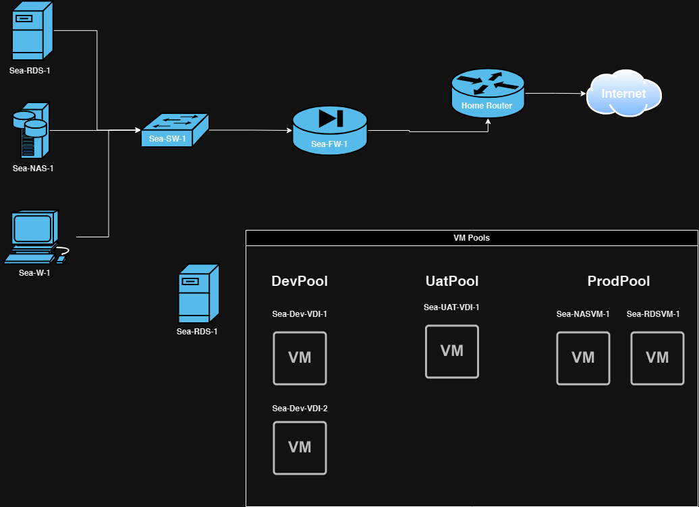

# Homelab Server:

Use Case:
To create a homelab server for learning and to achieve the following:

- [x] Have more storage rather than what is available on laptop
	* [x] Setup TrueNAS VM with HBA in zfs Raid 1
	* [ ] Setup Windows SMB for file sharing
- [ ] To better understand how to use virtualization
	* [x] Setup Proxmox on Homelab
    * [ ] Virtualize all services on Homelab
    * [ ] Add additional hyper-visors on VM's (nested-virtualization)
    * [ ] Understand Clustering / High Availability
    * [ ] Right-Size VM services
- [ ] To setup a space for indie game development
	* [ ] setup Game Engine
	* [ ] setup Perforce
	* [ ] setup remote services
	* [ ] setup Hansoft
- [ ] To have more control over my own data
- [ ] To implement a plan for backup and disaster recovery
	* [ ] Create backup configs
	* [ ] Create snapshots for dev VMs and Proxmox VMs
- [ ] To better understand how to setup services on Windows Server
	* [ ] Setup Windows Server DC
	* [ ] ADFS
- [ ] To better understand configuration management/orchestration
    * [ ] utilize Ansible / Powershell DSC for automating setup of VMs
    * [ ] use Chocolate / Scoop for package management
- [ ] To better understand continuous monitoring
    * [ ] setting up Zabbix / Grafana for syslog

Homelab Hardware Layout:
* 64-128GB ram
* 8c/16t CPU - low power if possible
* 2-4TB HDD WD RED - CMR drives
* 1TB nvme boot drive - cheapest you can find
* Dual NIC 2.5GB
* PSU low wattage with 80+ gold certification
* Managed switch 2.5GB
* HBA card or GPU card

