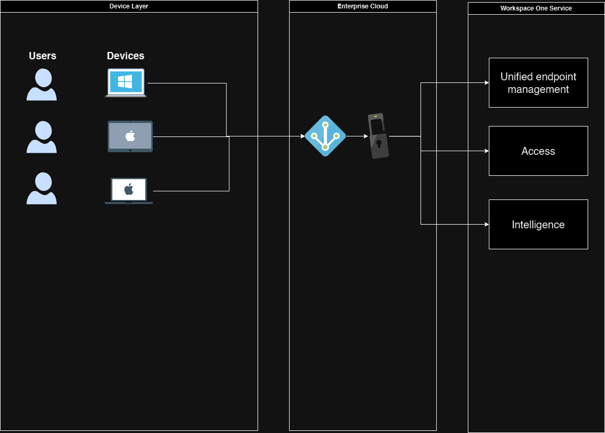

# Mobile Device Management Project:

This project is about deploying a Mobile Device Manager(MDM) into an organization.
The MDM that was used was VMware Workspace One UEM formerly known as Airwatch.

Example Documentation:

* [Vmware Techzone UEM to AAD](https://techzone.vmware.com/enrolling-windows-devices-using-azure-ad-workspace-one-uem-operational-tutorial#prerequisites-and-planning
 "Vmware Techzone UEM to AAD")

Use Case:

* Organization did not have a way to centrally manage machines.  
* The Organization did not have Microsoft Active Directory(MSAD).  
* The Organization did have Azure Active Directory which was not traditional MSAD.  The organization did also not have an On-Premise Virtual Private Network.  This led to a many bottlenecks in operations such as:
	* Slow/Delayed Onboarding.
	* Manual Updates.
	* Lack of Security features.
	* Poor application / package management.
	* No Automated Reporting for patches.
	* No Device Logs or System Logs.
	* No way to enforce device compliance to access applications based on Device Groups.

Based on the following a proposal was made to the Chief Technology Officer(CTO) based on Net-Present Value(NPV) to justify the cost of bringing in an MDM.  An initial presentation was created in order to compare the differences between using: MSAD, Azure Active Directory Domain Services (AADDS), and MDM.

After the NPV was approved the proposal was sent to the Chief Financial Officer(CFO) for approval and contract was approved and signed.  After contract was signed the intial setup was started and plans for initial deployment were made.  During this time the CTO had left the organization.

Project was completed and initial deployment had went out to 40 users.  30 that were windows and 10 were Mac.  The 1200 users we're completed by breaking them up into groups of 50 and deploying MDM to their devices.

Lessons Learned:

* Want to avoid Split Idenity as much as possible within MDM.
* Learn to expect "objections" from upper management concerning value of product.