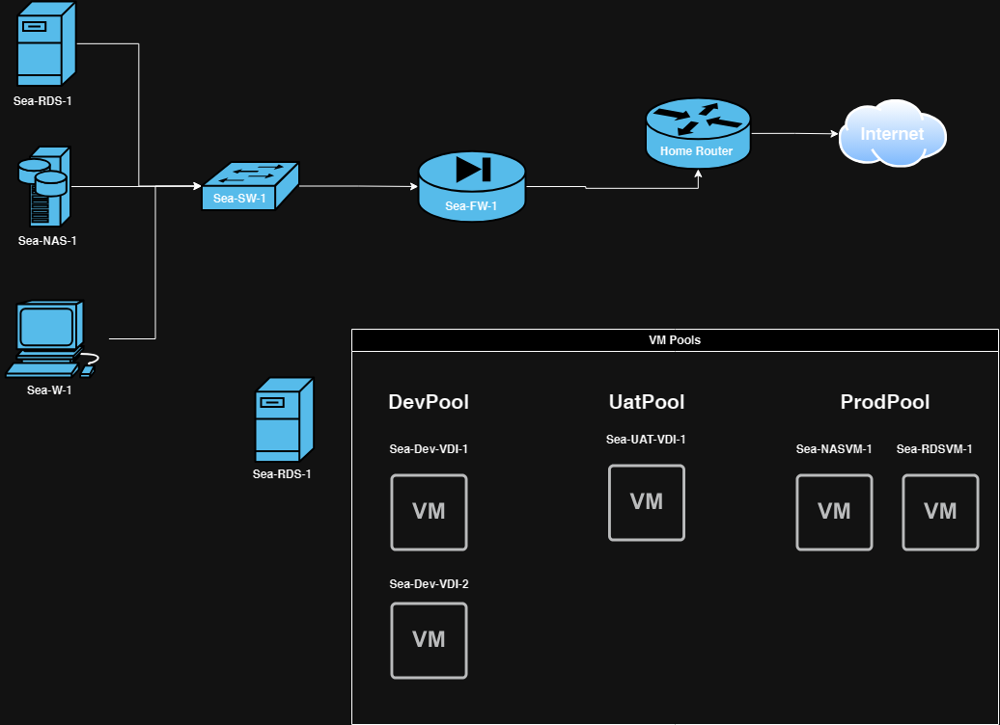

# Homelab Server with Perforce:

Use Case:
To create a homelab server for learning and to achieve the following:

- [x] Have more storage rather than what is available on laptop
	* [x] Setup TrueNAS VM with HBA in zfs Raid 1
	* [ ] Setup Windows SMB for file sharing
- [ ] To better understand how to use virtualization
	* [x] Setup Proxmox on Homelab
    * [ ] Virtualize all services on Homelab
    * [ ] Add additional hyper-visors on VM's (nested-virtualization)
    * [ ] Understand Clustering / High Availability
    * [ ] Right-Size VM services
- [ ] To setup a space for indie game development
	* [ ] setup Game Engine
	* [ ] setup Perforce
	* [ ] setup remote services
	* [ ] setup Hansoft
- [ ] To have more control over my own data
- [ ] To implement a plan for backup and disaster recovery
	* [ ] Create backup configs
	* [ ] Create snapshots for dev VMs and Proxmox VMs
- [ ] To better understand how to setup services on Windows Server
	* [ ] Setup Windows Server DC
	* [ ] ADFS
- [ ] To better understand configuration management/orchestration
    * [ ] utilize Ansible / Powershell DSC for automating setup of VMs
    * [ ] use Chocolate / Scoop for package management
- [ ] To better understand continuous monitoring
    * [ ] setting up Zabbix / Grafana for syslog

Homelab layout

1. ISP
	1. Setup ISP
		1. ISP is 400mb
		2. can upgrade to 800mb for $10
		3. have to check if router has wifi, if not purchase WAP
	2. Redundancy / Resiliancy
		1. ISP - none, requires 2nd internet connection
		2. Use internet from phone if ISP fails
2. Wan Level
	1. Firewall, No
	2. Get a managed switch
	3. Layer 2 or Layer 3
		1. Layer 2 preferred
	4. Vendor
		1. Cisco
		2. HP aruba
		3. No ubiquiti
	5. Redundancy / Resiliancy 
		1. resiliancy if cost effective and makes sense otherwise none.
	6. WAP
		1. Only if router does not have wifi built-in
		2. maybe necessary evil if wired networking fails.
		3. Redundancy / Resiliancy - none, only purchasing 1 WAP
	7. LAN
		1. Use 2.5GB switch or 10GB switch
	8. File Server / Hardware
		1. Will purchase hardware and build own
		2. Storage
			1. SSD
				1. WD SN750 1 TB - boot drive
			2. HDD
				1. WD NAS 4TB 5400 RPM CMR
				2. Seagate Ironwolf 4TB 5400 RPM CMR
			3. HDD/SSD usage
				1. 1 - Boot Drive / SSD (Nothing is going to live here)
				2. 2 - Raid 1 - prod
				3. 3 - Raid 1 backup
				4. 4 - Data
				5. 5 - Test environment
			4. RAM
				1. start 32GB and upgrade to 64GB
				2. or start 64GB and upgrade to 128gb
			5. OS
				1. Layer 1
					1. Proxmox
					2. Windows Server 2022
				2. Layer 2
					1. VMware VM workstation player
					2. Hyper-V
					3. Oracle VM VirtualBox 
				3. How many VM’s
					1. 5-7 (VM's will placed in pools)
						1. Prod-Pool
							1. 1 - Windows Server VM to hold perforce
							2. 2 cores / 4 GB RAM / 128 GB storage
							3. 2 - Linux VM for TrueNas
							4. 2 cores / 8 GB RAM / 48 GB storage
							5. 3 - Windows Server VM for Active Directory
							6. DNS / LDAP / LDFS / DHCP / ADFS
							7. 2 cores / 2 GB RAM / 100 GB storage
						2. UAT-Pool
							1. 4 - Windows10 Test VM
							2. for testing configuration management
							3. 2 cores / 2 GB RAM / 100 GB storage
						3. Dev-Pool
							1. 5 - Windows10 Dev VM
							2. 2 cores / 4 GB RAM / 100 GB storage
			6. Backup / Disaster recover
				1. What is good backup software?
				2. What are good 2 bay enclosures?
				3. What cloud areas I can use
					1. Google Drive
					2. Onedrive
					3. Next Cloud
						1. important docs can go there.
					3. Power backup
						1. might get rackmount UPS or basic cheap UPS
						2. need to check to make sure powerstrips are good
			7. Network security
				1. Create a VPN?
				2. Create a proxy?
				3. I’m not sure what basic network security I can have in place.
			8. Network configuration
				1. start with the private IP range
					1. 10.0.0.0 (preferred)
					2. 172.169.0.0
					3. 192.168
				2. Vlan’s
					1. 1 - Management Port
					2. 2 - Production Devices
					3. 3 - DMZ services

